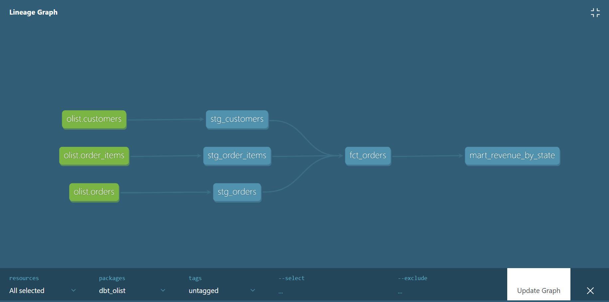
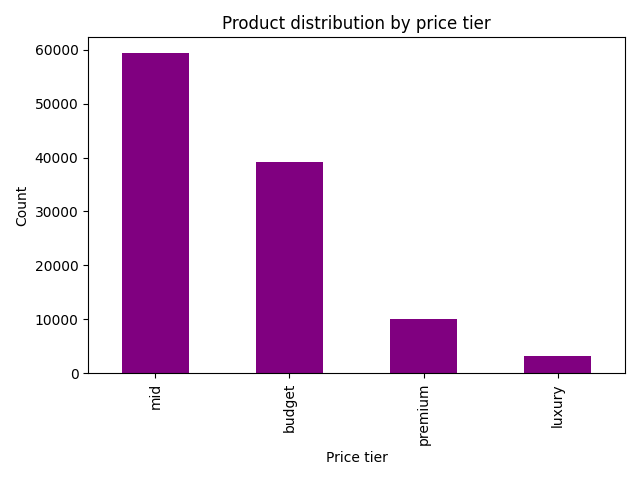

# Olist E-Commerce ETL Pipeline

A production-style data platform that processes 100k+ Brazilian e-commerce records through a modern lakehouse architecture — built with Python, DuckDB, Apache Parquet, and dbt.

---

## Architecture

### Layer 1 — ETL Pipeline (Python)

```
data/raw/          →    extract.py    →    transform.py
(4 CSV files)           (load & check)     (clean & merge)
                                                ↓
logs/pipeline_runs.csv  ←   load.py   ←   validate.py
output/olist_clean.csv      (export)       (12 quality checks)
```

### Layer 2 — Lakehouse (DuckDB + Parquet + dbt)

```
data/raw/.csv
↓  [ingest.py — converts to Parquet]
lakehouse/warehouse/.parquet
↓  [DuckDB — persistent database]
lakehouse/catalog/olist.duckdb
↓  [dbt models]
staging/ → core/ → marts/
```

### dbt Lineage Graph



---

## Quick Start

```bash
# 1. Clone the repository
git clone https://github.com/HeldiLami/olist-etl-pipeline.git
cd olist-etl-pipeline

# 2. Create virtual environment
python -m venv venv
venv\Scripts\activate      # Windows
source venv/bin/activate   # Mac/Linux

# 3. Install dependencies
pip install -r requirements.txt

# 4. Add raw data
# Download from: kaggle.com/datasets/olistbr/brazilian-ecommerce
# Place all CSV files in data/raw/

# 5. Run ETL pipeline
python src/main.py

# 6. Run lakehouse ingestion
python lakehouse/ingest.py

# 7. Run dbt models
cd dbt_olist
dbt run
dbt test

# 8. View documentation
dbt docs generate
dbt docs serve
```

---

## Key Findings

After processing **111,715 records** across **99,441 orders**:

| Metric                  | Value               |
| ----------------------- | ------------------- |
| Total revenue processed | $15,805,788         |
| Average delivery time   | 12.1 days           |
| Late delivery rate      | 7.3%                |
| Data quality score      | 10/11 checks passed |
| Price outliers detected | 7.5% of products    |



---

## Data Quality

- **7 automated dbt tests** — `not_null` and `unique` across all staging models
- **3-layer validation framework** — completeness, consistency, distribution
- Every pipeline run logged to `logs/pipeline_runs.csv` with full audit trail

---

## Tech Stack

| Tool           | Purpose                                        |
| -------------- | ---------------------------------------------- |
| Python 3.11    | Core language                                  |
| Pandas         | ETL logic and data manipulation                |
| DuckDB         | Analytical query engine (columnar, serverless) |
| Apache Parquet | Columnar storage format                        |
| dbt            | SQL transformation layer with tests and docs   |
| NumPy          | Statistical computations                       |

---

## Project Structure

```
olist-etl-pipeline/
├── data/raw/ ← source CSV files (not tracked)
├── lakehouse/
│ ├── warehouse/ ← Parquet files (not tracked)
│ ├── catalog/ ← DuckDB database (not tracked)
│ ├── ingest.py ← CSV → Parquet conversion
│ └── query_test.py ← DuckDB query examples
├── dbt_olist/
│ ├── models/
│ │ ├── staging/ ← stg_orders, stg_customers, stg_order_items
│ │ ├── core/ ← fct_orders
│ │ └── marts/ ← mart_revenue_by_state
│ └── dbt_project.yml
├── src/
│ ├── extract.py
│ ├── transform.py
│ ├── validate.py
│ └── load.py
├── images/
│ ├── lineage_graph.png
│ └── price_distribution.png
├── requirements.txt
└── README.md
```
